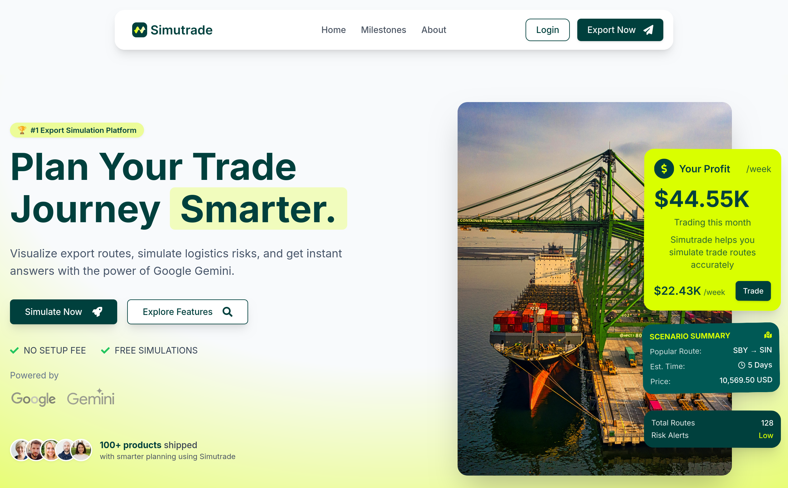
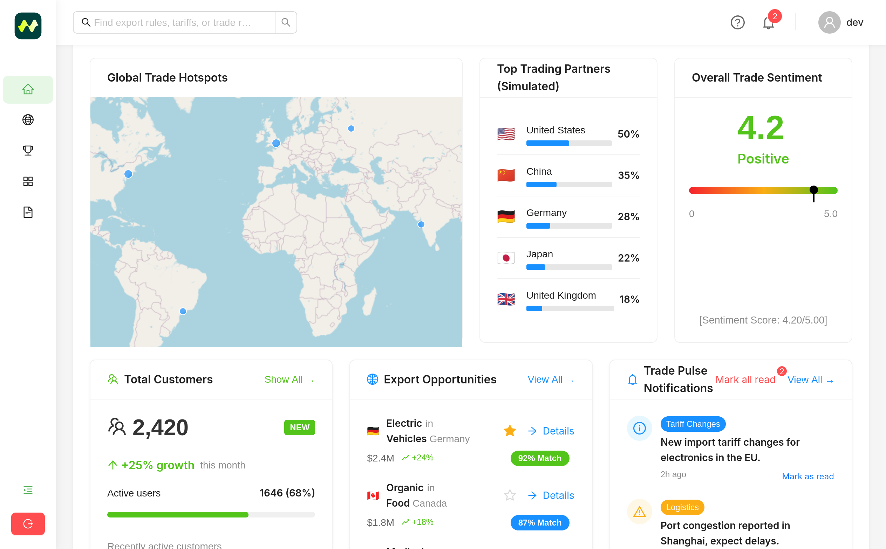
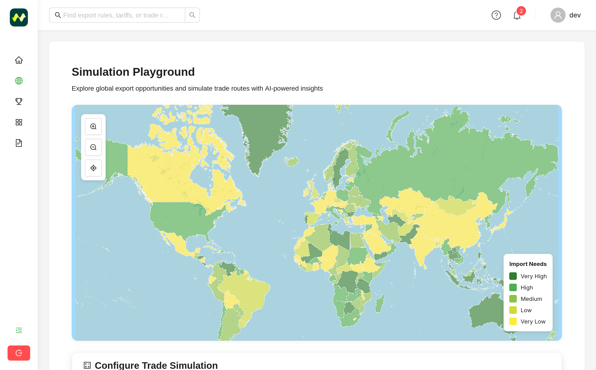
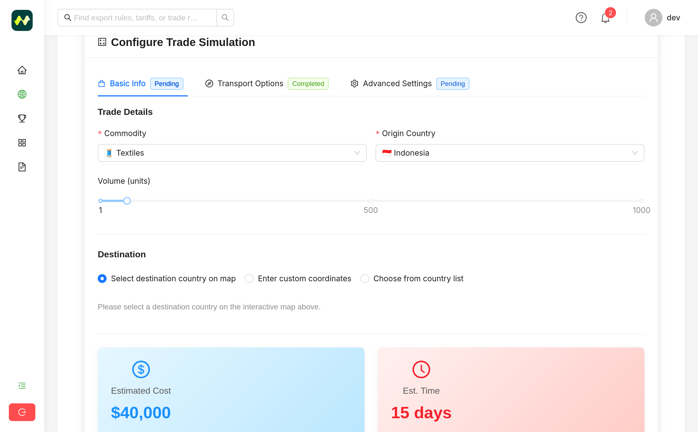
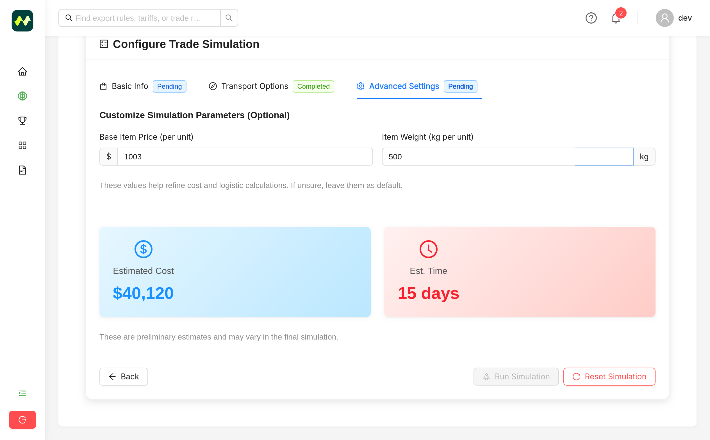

<div align="center">
  <table border="1">
    <tr>
      <td align="center" style="padding: 20px;">
        <h3>📢 Domain & Email Migration Notice</h3>
        <p>From <b>May 24 th, 2026</b>, Fairleap AI will transition to new domains as <code>fairleap.cloud</code> will not be renewed:</p>
        <p>🌐 <b>Website:</b> <a href="https://fairleap.faizath.com">fairleap.faizath.com</a> (formerly <i>fairleap.cloud</i>)<br>
        ⚙️ <b>API:</b> <a href="https://fairleap-api.faizath.com">fairleap-api.faizath.com</a> (formerly <i>api.fairleap.cloud</i>)<br>
        📧 <b>Email:</b> <a href="mailto:contact@fairleap.faizath.com">contact@fairleap.faizath.com</a> (formerly <i>contact@fairleap.cloud</i>)<br>
        🛰️ <b>CDN:</b> <a>fairleap-cdn.faizath.com</a> (formerly <i>cdn.fairleap.cloud</i>)<br>
        📈 <b>Status Pages:</b> <a href="https://status.faizath.com/status/fairleap">https://status.faizath.com/status/fairleap</a> (formerly <i>status.fairleap.cloud</i>)
        </p>
      </td>
    </tr>
  </table>
</div>

<p align="center">
  
  <h1 align="center">Fairleap AI API Backend</h1>
</p>
   
## 📘 Project Overview
Fairleap AI is a platform designed to address income uncertainty and enhance the well-being of Gojek/GOTO drivers.

Fairleap AI is deployed on [fairleap.cloud](https://fairleap.cloud) and it's API (Back End) deployed on [fairleap.cloud](https://api.fairleap.cloud)

Fairleap AI Frontend Repository: [https://github.com/Fairleap-AI/fairleap-fe](https://github.com/Fairleap-AI/fairleap-fe)<br>
Fairleap AI API Backend Repository: [https://github.com/Fairleap-AI/fairleap-api](https://github.com/Fairleap-AI/fairleap-api)<br>
Fairleap AI RAG + AI Backend Repository: [https://github.com/Fairleap-AI/fairleap-ai](https://github.com/Fairleap-AI/fairleap-ai)

<!--
<p align="center">
  
  
  
  
  
  
  
  
  
  
</p>
-->

## 🛠️ Tech Stacks

- **Node.js**: A fast, event-driven JavaScript runtime built on Chrome’s V8 engine for building scalable network applications.
- **Express.js**: A minimal and flexible Node.js web application framework that provides a robust set of features for web and mobile applications.
- **Docker**: A platform for developing, shipping, and running applications inside lightweight containers to ensure consistency across environments.
- **MongoDB**: A NoSQL database designed for scalability and flexibility, storing data in JSON-like documents.

## ⚙️ Installation
To set up Fairleap AI API backend, start by clone the repository
   ```sh
   git clone https://github.com/Fairleap-AI/fairleap-api
   cd fairleap-api
   ```

To set up the Backend locally, run:
   ```sh
   npm run dev
   ```

To deploy using Docker compose, run:
   ```sh
   docker compose up
   ```

## 📝 License
This project is licensed under the MIT License.