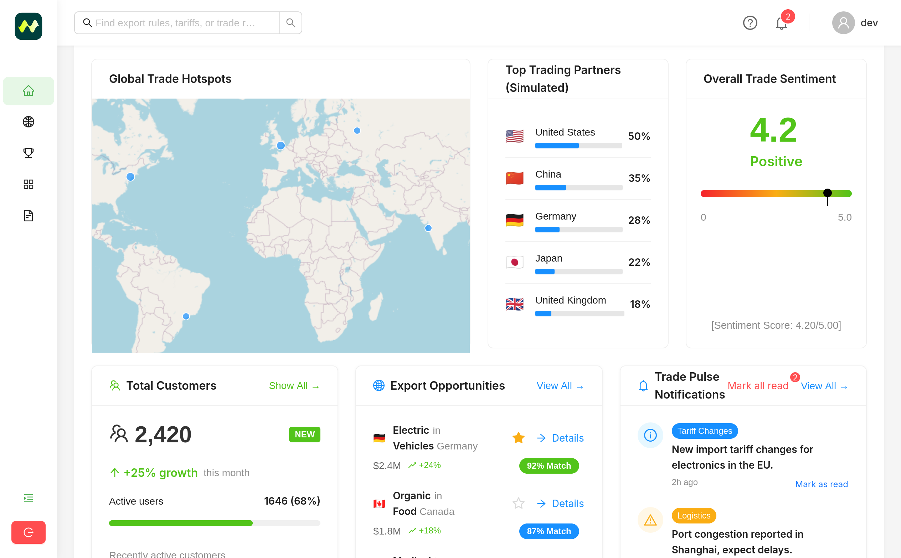
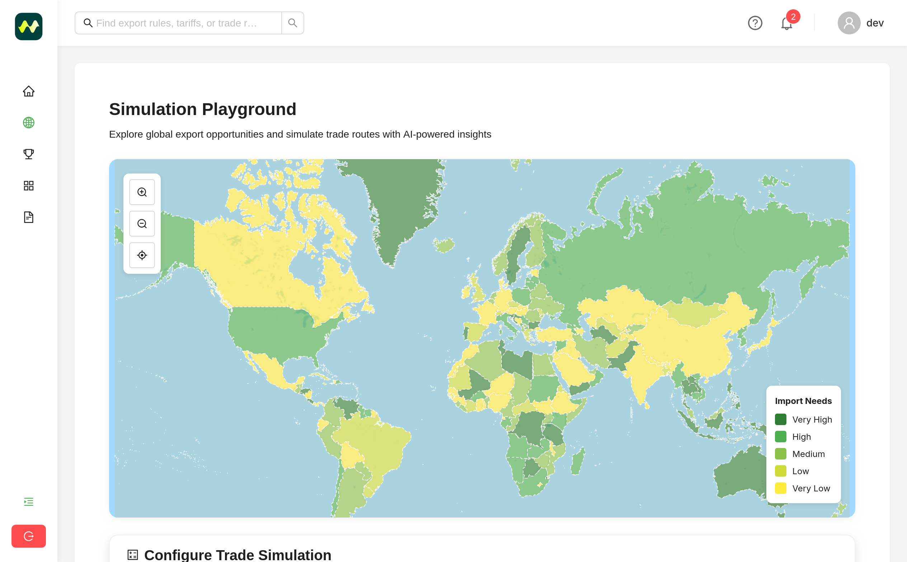

<p align="center">
  
  <h1 align="center">Fairleap AI API Backend</h1>
</p>
   
## 📘 Project Overview
Fairleap AI is a platform designed to address income uncertainty and enhance the well-being of Gojek/GOTO drivers.

Fairleap AI is deployed on [fairleap.cloud](https://fairleap.cloud) and it's API (Back End) deployed on [fairleap.cloud](https://api.fairleap.cloud)

Fairleap AI Frontend Repository: [https://github.com/Fairleap-AI/fairleap-fe](https://github.com/Fairleap-AI/fairleap-fe)<br>
Fairleap AI API Backend Repository: [https://github.com/Fairleap-AI/fairleap-api](https://github.com/Fairleap-AI/fairleap-api)<br>
Fairleap AI RAG + AI Backend Repository: [https://github.com/Fairleap-AI/fairleap-ai](https://github.com/Fairleap-AI/fairleap-ai)

<!--
<p align="center">
  
  
  
  
  
  
  
  
  
  
</p>
-->

## 🛠️ Tech Stacks

- **Node.js**: A fast, event-driven JavaScript runtime built on Chrome’s V8 engine for building scalable network applications.
- **Express.js**: A minimal and flexible Node.js web application framework that provides a robust set of features for web and mobile applications.
- **Docker**: A platform for developing, shipping, and running applications inside lightweight containers to ensure consistency across environments.
- **MongoDB**: A NoSQL database designed for scalability and flexibility, storing data in JSON-like documents.

## ⚙️ Installation
To set up Fairleap AI API backend, start by clone the repository
   ```sh
   git clone https://github.com/Fairleap-AI/fairleap-api
   cd fairleap-api
   ```

To set up the Backend locally, run:
   ```sh
   npm run dev
   ```

To deploy using Docker compose, run:
   ```sh
   docker compose up
   ```

## 📝 License
This project is licensed under the MIT License.